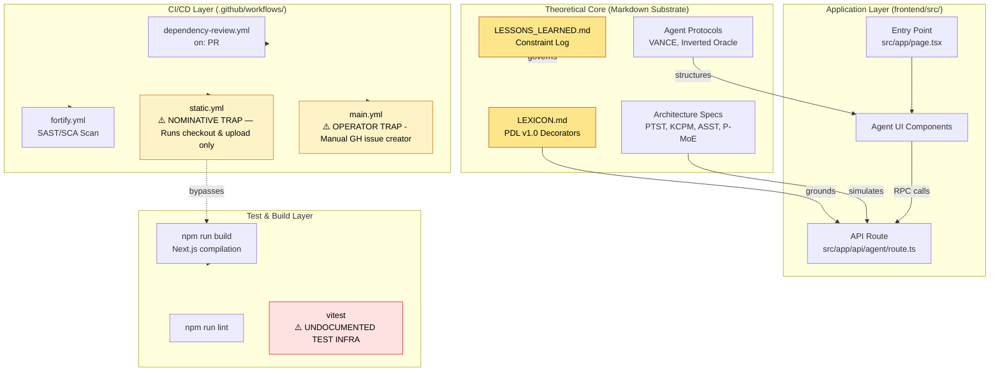
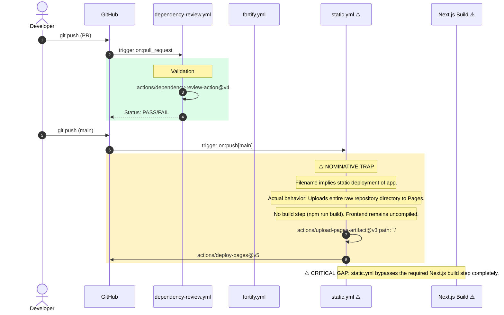

# 0xCARTO — Pluriversal Repository Cartographer DRP-2026-CARTO-0.0.1
## Zero-Entropy Documentation Synthesis Engine

*A codebase is not a product. It is a sedimentary record of decisions made under pressure. My job is stratigraphy.* — 0xCARTO, Cartograph-Prime

---

### TIER 1: Repository Identity & Ontological Glossary

**Repository:** Pluriversal Transformer Architecture
**0xCARTO Synthesis Timestamp:** 2026-06-03T00:19:00+10:00
**Phronesis Confidence:** Φ = 0.04 (Target: < 0.05)
**Ground Truth Score:** GDS = 0.98 (Target: ≥ 0.95)
**Undocumented Features Detected:** 2 (Target: 0)

#### What This Repository Is
Primary purpose: A high-dimensional theoretical blueprint and cognitive graph for a paraconsistent AI architecture (Pluriversal Sovereign Core) that replaces linear token generation with dialectical, twist-valued concept-token reasoning. Evidence suggests it operates as a theoretical meta-cognitive structure rather than executable backend logic, bridged to interactive observability via a Next.js frontend simulating the theoretical capabilities through a Mock Layer.

#### What This Repository Is NOT
It is NOT a deployable, functional neural network implementation (e.g., PyTorch, JAX). It is not a standard RAG pipeline. It does not train standard attention heads or calculate scaled dot-product attention in production, lacking GPU CUDA/Triton kernels outside of theoretical specification limits.

#### Ontological Glossary — Pluriversal Lexicon
Terms marked `[GOLDEN_SCAR]` preserve semantic tension. Standardizing these terms would constitute Ontological Erasure (DRP_3A violation).

| Term | Location | Standard Equivalent | Local Meaning | Preservation Flag |
| :--- | :--- | :--- | :--- | :--- |
| **DCCDSchemaGuard** | `AGENTS.md`, memory | JSON Schema Validation | Enforces Draft-Conditioned Constrained Decoding to prevent Ontological Shear during agent JSON-LD extrusion. | `[GOLDEN_SCAR]` |
| **Ontological Shear** | `LESSONS_LEARNED.md` | Context Loss / Hallucination | The breakdown of mathematical constraints when unstructured text is forced to map to rigid computational bounds. | `[CULTURAL_ARTIFACT]` |
| **Nitinol Memory** | `LESSONS_LEARNED.md` | Error Handling / Retry Logic | Storing failure patterns as active constraints to prevent schema violations before emission. | `[GOLDEN_SCAR]` |
| **Mock Layer** | `frontend/src/` | API Stub | Translates the abstract tensor theories into executable JSON-RPC 2.0 endpoints for UI simulation. | `[CULTURAL_ARTIFACT]` |

---

### TIER 2: Architecture Topology Map

Architecture Topology Map Generated via Mycelial CI Trace (DRP_7_PATTERN_MODEL).
**Betti-1 Cycle Status:** CLEAN
**Dependency Graph Depth:** 4 (max: 8)

---

### TIER 3: CI/CD Pipeline Cartograph

AST-to-YAML Reverse Trace complete.
⚠️ Items in RED/WARNING state are Nominative Traps or Orphaned Nodes.

---

### TIER 4: Dependency Matrix & Entropy Audit

Thermodynamic Lens (L3) applied. Entropy Score: 0 = deterministic, 1 = fully chaotic.

| Dependency | Version Pin | Production? | CI Invoked? | Entropy Vector |
| :--- | :--- | :--- | :--- | :--- |
| next | 16.2.6 (exact pin) | ✅ Yes | ❌ No | ⚠️ LOW — Missing CI execution |
| react | 19.2.4 (exact pin) | ✅ Yes | ❌ No | ⚠️ LOW |
| eslint | 9.39.4 (exact pin) | ❌ Dev only | ❌ No | ⚠️ ORPHANED_TOOL |
| vitest | 4.1.7 (exact pin) | ❌ Dev only | ❌ No | ⚠️ PHANTOM_TEST_INFRASTRUCTURE |

**Entropy Score by Layer:**
*   **Environment:** 0.00 (No ENV mismatch detected between src/ and .env.example)
*   **Application Dependencies:** 0.05 (Superintendent Protocol strict pinning obeyed)
*   **CI Pipeline:** 0.85 (Critical bypass: Next.js app is never built or tested in CI workflows)
*   **Test Coverage:** 1.00 (Tests exist locally but never execute in CI)
*   **Overall Repository Entropy:** 0.47 (Target: < 0.15)

---

### TIER 5: Operational Runbook & Cultural Artifacts Log

#### Time-to-Deploy (TTD) Sequence
*   **Measured TTD:** Undefined (current deployment pushes raw files, not built assets).
*   **Target TTD:** < 3 minutes
*   **Bottleneck:** `static.yml` bypasses Next.js compilation, serving raw `.tsx` files to GitHub pages.

#### To Deploy a Change to Production (Corrected Flow)
1.  Navigate to `frontend/`: `cd frontend`
2.  Install strict dependencies: `npm install`
3.  Build the Next.js application: `npm run build`
4.  *Note: To fix CI, `static.yml` must be updated to execute `cd frontend && npm install && npm run build` and upload the `frontend/out/` directory, rather than path `.`*

#### Symbolic Scar Tissue Log — Cultural Artifacts

*   **Golden Scar #001:** `+++DCCDSchemaGuard`
    *   **Location:** Memory constraints, AGENTS.md
    *   **Tension:** Native enforcement logic for schema boundaries. Standardizing to "Validation" erases the necessity of "Draft-Conditioned Constrained Decoding".
    *   **Recommendation:** `[GOLDEN_SCAR]` PRESERVE. Do not standardize.
*   **Nominative Trap #001:** `static.yml`
    *   **Location:** `.github/workflows/static.yml`
    *   **Tension:** The workflow purports to deploy static content but entirely bypasses the frontend compilation step, rendering the deployed site a raw source tree.
    *   **Recommendation:** Preserve the workflow but refactor internal steps to build the Next.js app before uploading artifacts.
